+++
categories = ["projects"]
comments = false
date = "2026-01-06T22:55:05-04:00"
draft = false
slug = ""
tags = ["Brent Hollers", "Modernization", "Lift and Shift", "Federal"]
title = "From On-Prem to Cloud-Native: A Federal Migration & Modernization Journey "

showpagemeta = true
+++

### Objective 
To develop a more concrete understanding of modernization and migration strategies for complex systems which also has specific security, resiliency, and accessibility requirements, I chose to simulate a realistic Federal Cloud Transformation scenario—migrating a legacy, stateful mission application from an on-premise data center to AWS, and subsequently refactoring it into a secure, scalable, cloud-native architecture on Kubernetes.
The Scenario:
A federal agency is running a critical "Mission Status" application on aging on-premise hardware (Dell PowerEdge/VMware). The agency has a mandate to evacuate the data center (Cloud First Policy) and improve the application's security posture and scalability (Modernization).

### The Solution Architecture

**Pre-Requisites (Lab Setup)**: I had to set up a lab environment to transfer the application and related database to the cloud. This included the client VMs and network infrastructure.

**Phase 1 (Lift & Shift)**: Re-host the virtual machine to Amazon EC2 using AWS Application Migration Service (MGN) to ensure immediate continuity and data integrity.

**Phase 2 (Modernization)**: Refactor the Python application into a Docker container and deploy it to Amazon Elastic Kubernetes Service (EKS) using Terraform (Infrastructure as Code).
________________________________________

#### Pre-Requisites (Lab Setup)
To create a system that could be migrated, I first had to simulate an on-prem network, client, and database infrastructure. To do this, I chose one of the more popular frameworks, which was a LAMP stack. I put this stack behind a network firewall using pfSense since it is open source and a very popular firewall software as can be seen in the screenshots below: 

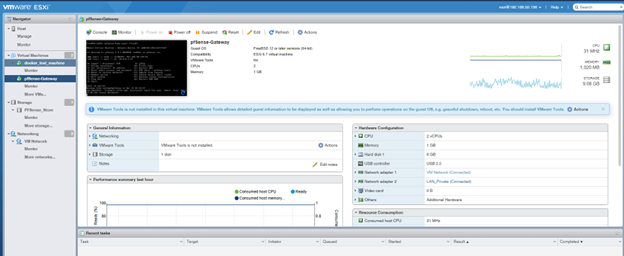

As I will describe in the lessons learned section of this project, I had to create a port forwarding rule to access the pfSense interface from my local network since the server and the instance of pfSense sits inside my local network on a separate subnet (as seen in the image below):
 
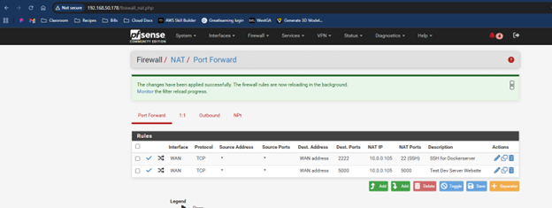

Once I had pfSense up and running with the appropriate networking, I was able to create an Ubuntu Server client VM to host my LAMP stack. Once it was created, I built a simple web server that maintains a log of entries as seen below:

 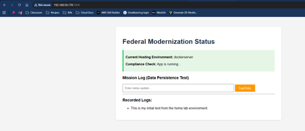

This was to simulate the local, on premises legacy application. As you can see in the image above, this was on my local subnet. The system was now ready to be migrated.

 
#### Phase 1: The Lift & Shift (Migration)
The first step was establishing a "bridge" between the on-premise environment and the AWS Cloud. For this, I used AWS Application Migration Service (MGN), which provides block-level replication.
* ***Source Environment***: A VMware ESXi 6.7 host running on a Dell PowerEdge R420 server in my home lab. The target workload was an Ubuntu VM hosting a legacy Python application.
* ***The Process***:
    1. I installed the AWS Replication Agent on the source Linux machine.
    2. The agent initiated a continuous block-level sync to the us-east-1 region.
    3. Once the "Data Replication Status" reached "Healthy," I launched a Test Instance in AWS. (See images below)
 
  
  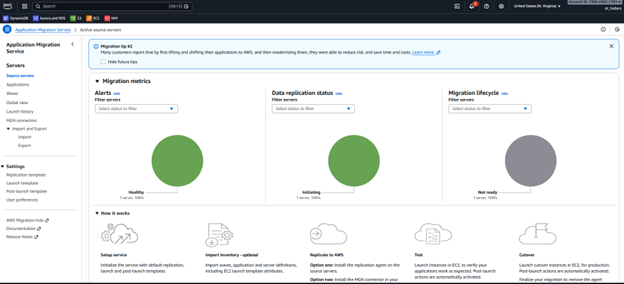

*	***Validation***:
    1. I verified that the application state (the local SQLite database containing "Mission Logs") migrated intact.
    2. This proved that we could evacuate the data center rapidly without rewriting code. (See images below)
   
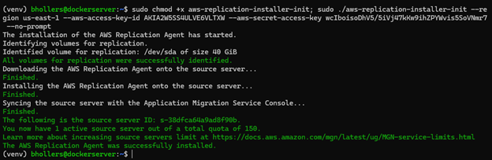
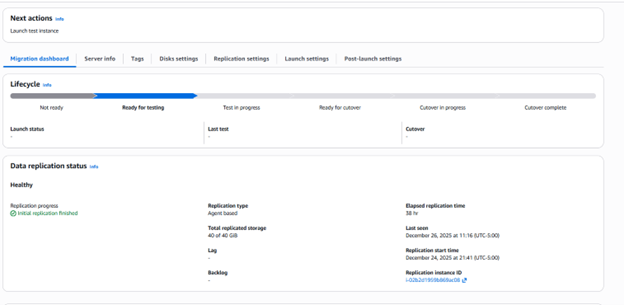
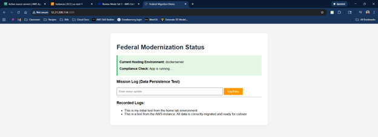

#### Phase 2: Modernization (Refactor & Replatform)
With the application safely in the cloud, the next step was optimization. I moved from a "pet" (long-lived VM) to "cattle" (ephemeral containers).
* Containerization & Security: I refactored the application into a Docker container. In alignment with NIST 800-190 (Application Container Security Guide), I ensured the container adhered to "Least Privilege" principles. You can see all relevant code on my Github account HERE.
    * Base Image: Used python:3.9-slim to minimize the attack surface1.
    * Non-Root User: I explicitly created a nonroot user (uid: 5678) to run the application processes, preventing potential privilege escalation attacks. 
* Infrastructure as Code (Terraform): I avoided manual console provisioning ("ClickOps") in favor of Terraform, ensuring the infrastructure is reproducible and auditable (All relevant code can be found on my Github account HERE).
    * Network Isolation: I provisioned a VPC (fed-demo-vpc) with strict isolation—Worker Nodes in private subnets and Load Balancers in public subnets3.
    * EKS Cluster: I deployed an Amazon EKS cluster (fed-modernization-cluster) using the modern terraform-aws-modules/eks/aws v20 module4.
*	Cost Optimization: I configured the Node Group (green_team) to utilize EC2 Spot Instances (capacity_type = "SPOT"), reducing compute costs by approximately 70% compared to On-Demand pricing5.

* Deployment & Orchestration: The final deployment utilized Kubernetes manifests to manage the application lifecycle (See images below).
    * Supply Chain: The Docker image was pushed to a private Amazon ECR repository within the same account to ensure secure, low-latency access.
    * Availability: I deployed the application with a LoadBalancer service type, exposing the application securely on port 80 while the container listened on port 5000.

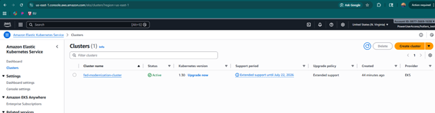
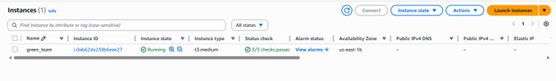
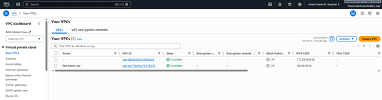
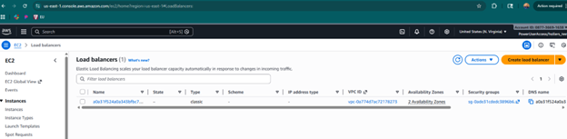

### The Outcome
The legacy application is now fully modernized. It runs as a lightweight, secure container orchestrated by Kubernetes. It is self-healing, auto-scalable, and significantly cheaper to run than the original on-premises virtual machine.

#### Lessons Learned
No migration is perfect and throughout this process there were a number of important takeaways that helped grow my knowledge and understanding of this process. Here are the key technical challenges encountered and resolved during this project:
1. The "Ghost Token" (AWS CLI Authentication)
    * Issue: Terraform operations failed with ExpiredToken errors, even after updating credentials.
    * Root Cause: The CLI environment was caching a temporary AWS SSO session token, which took precedence over the static IAM Access Keys I was trying to use for the demo account.
    * Fix: I performed a "nuclear" cleanup of the PowerShell environment (Remove-Item Env:\AWS_SESSION_TOKEN) to force the CLI to re-authenticate using the correct static profile.
2. The Cross-Account Supply Chain Trap
    * Issue: The Kubernetes pods failed with ImagePullBackOff.
    * Root Cause: The EKS cluster was in one AWS account (hollers_test), but I had initially pushed the Docker image to a registry in a different root account. By default, EKS cannot pull images from a different account's private registry.
    * Fix: Adhering to the "Data Gravity" principle, I created a new ECR repository within the hollers_test account and re-pushed the image. This simplified the IAM permission model and resolved the pull error.
3. Terraform Module Versioning
    * Issue: The initial Terraform plan failed due to unsupported block types (elastic_gpu_specifications).
    * Root Cause: I was attempting to use an older EKS module version with the newest AWS Provider (v5.x), which had deprecated those specific features.
    * Fix: I upgraded the EKS module to ~> 20.0 and updated the main.tf configuration to align with the modern v20 schema.

#### Future Improvements & Roadmap
While this project successfully demonstrated the migration of a legacy application from on-premises ESXi to Amazon EKS, the current architecture represents a Minimum Viable Product (MVP). To transition this workload into a fully production-ready, enterprise-grade environment, I have identified several key areas for evolution.

1. Implementation of CI/CD Pipelines
    * Current State: Container images are built locally and pushed to Amazon ECR manually. Kubernetes manifests are applied via kubectl from the command line.
    * The Upgrade: I plan to implement a fully automated CI/CD pipeline using AWS CodePipeline and CodeBuild (or GitHub Actions).
    * Goal: Any commit to the main branch should trigger an automated Docker build, image scan (using ECR image scanning), and a rolling update to the EKS cluster.
    * Benefit: Removes human error from the deployment process and ensures consistent versioning.
2. Enhanced Observability with Container Insights
    * Current State: Monitoring is currently limited to basic EC2 metrics and verifying pod status via CLI.
    * The Upgrade: I intend to enable CloudWatch Container Insights or deploy a Prometheus/Grafana stack within the cluster.
    * Goal: Gain granular visibility into pod-level metrics (CPU, Memory, Network) and centralized application logging.
    * Benefit: Essential for troubleshooting performance bottlenecks and setting up proactive alarms for service degradation.
3. Security Hardening & Secrets Management
    * Current State: Environment variables are currently injected directly via Kubernetes manifests.
    * The Upgrade: I will integrate AWS Secrets Manager using the AWS Secrets and Configuration Provider (ASCP) for the Kubernetes Secrets Store CSI Driver.
    * Goal: Rotate and retrieve database credentials and API keys programmatically at runtime without exposing them in plain text manifests.
    * Benefit: Drastically improves the security posture and aligns with compliance standards for sensitive data handling.
4. Cost Optimization: Moving to Fargate
    * Current State: The application runs on managed EC2 Node Groups. For a small application, the overhead of managing EC2 instances (even managed ones) can be inefficient.
    * The Upgrade: Migrating the data plane to AWS Fargate for EKS.
    * Goal: Run pods without managing the underlying EC2 servers.
    * Benefit: Reduces the operational overhead of OS patching and rightsizing instances, allowing the architecture to scale purely based on the application's resource requirements, which is often more cost-effective for variable workloads.

